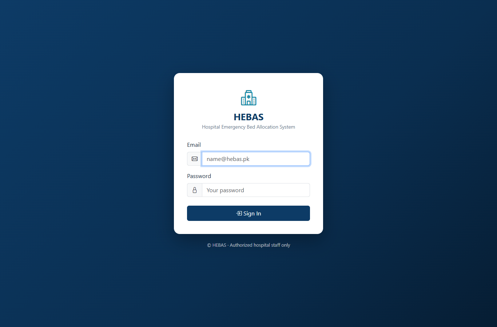
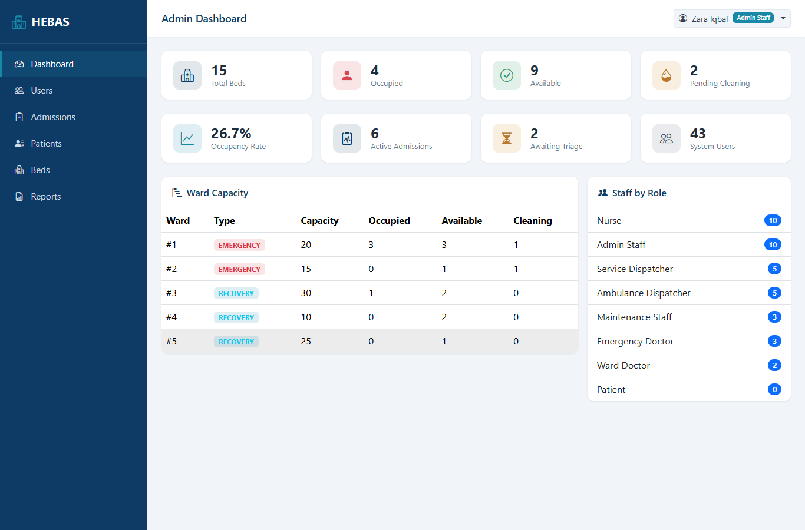
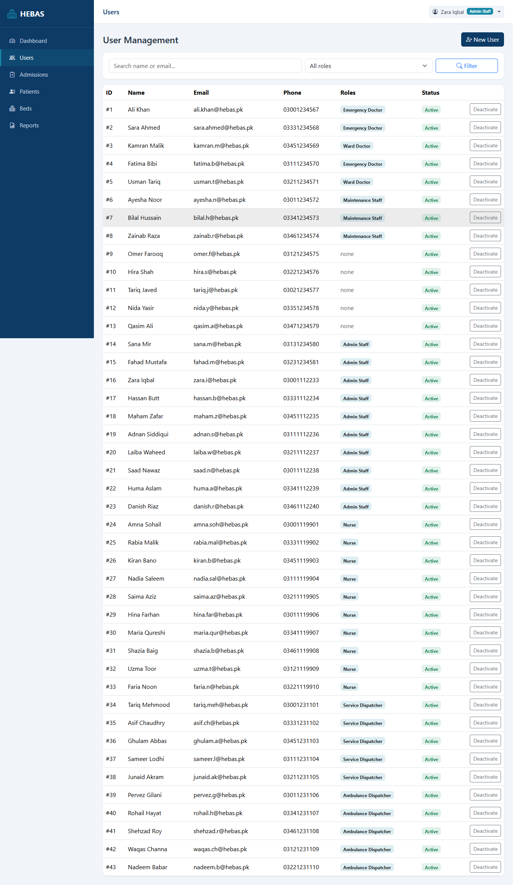
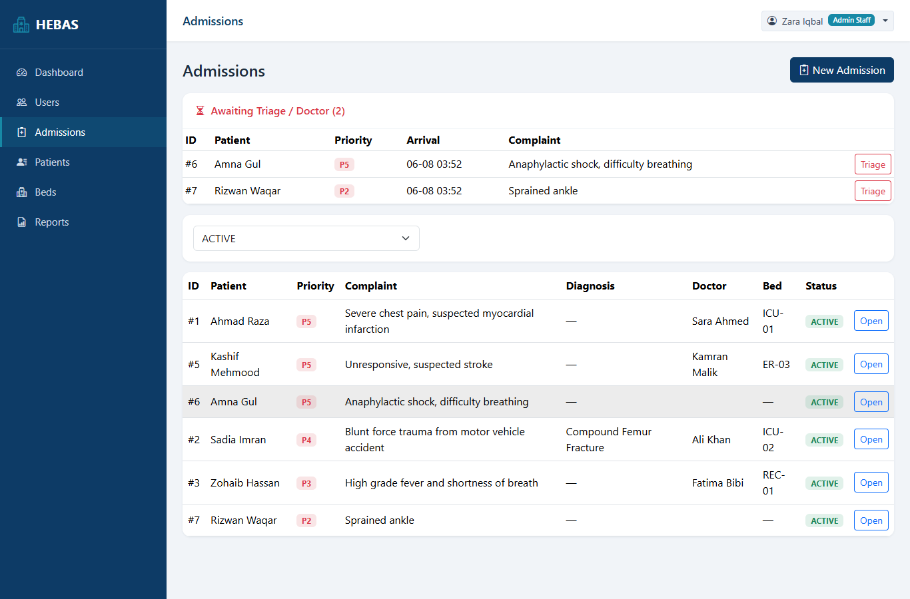
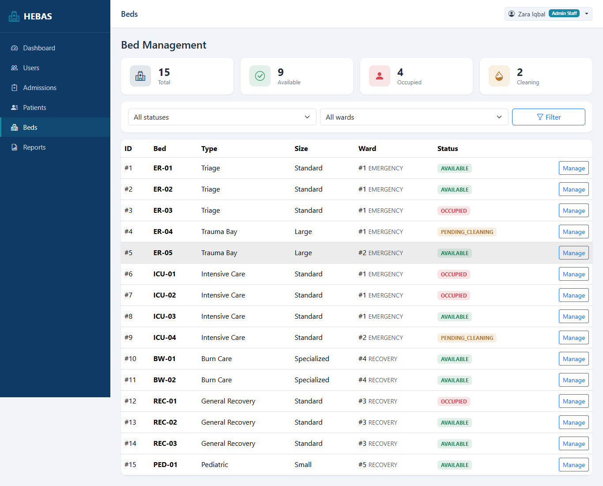
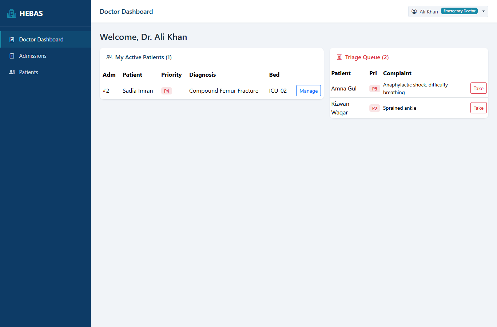
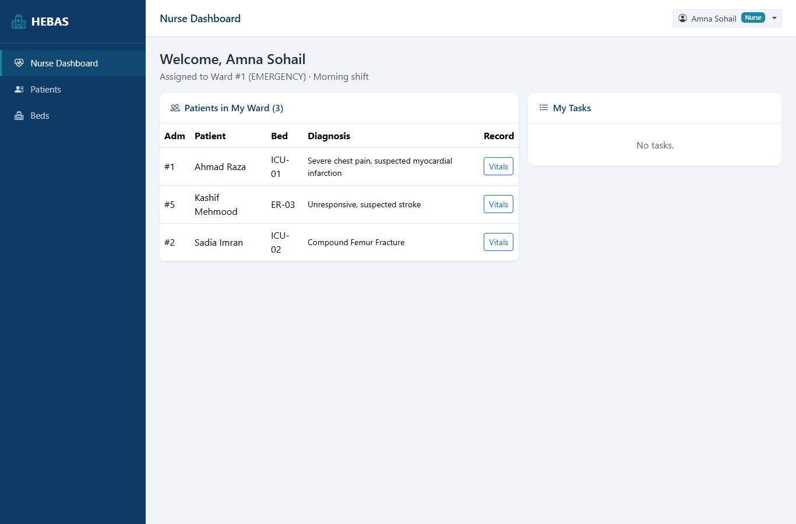
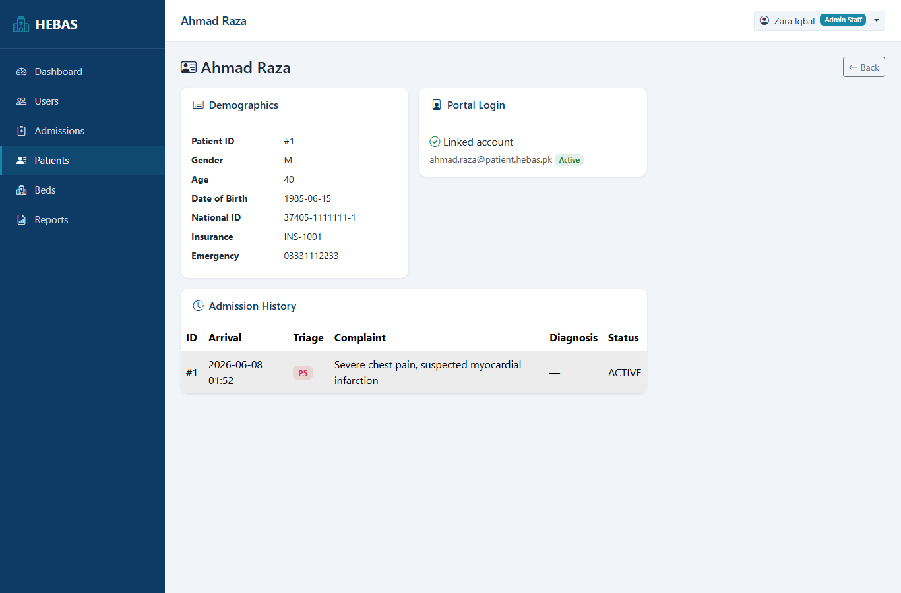

# 🏥 Hospital Emergency Bed Allocation System (HEBAS)

HEBAS is a comprehensive, role-based web application designed to streamline the management of emergency hospital beds, patient admissions, and inter-departmental coordination. 

Developed as a robust database and software engineering solution, HEBAS ensures real-time tracking of bed availability, seamless staff communication, and efficient patient routing during critical emergency scenarios.

## 📸 Project Screenshots

Here is a look at the various role-based dashboards and interfaces within HEBAS:

### Login & Authentication


### Admin Dashboard (Overview & User Management)



### Hospital Operations (Admissions & Beds)



### Medical Staff Interfaces



### Patient Portal



## ✨ Key Features

* **Role-Based Access Control (RBAC):** Tailored dashboards and permissions for Admins, Doctors, Nurses, Dispatchers, and Maintenance/Sanitization staff.
* **Real-Time Bed Tracking:** Monitor ward capacities, bed statuses (Available, Occupied, Maintenance, Cleaning), and automated bed allocation.
* **Patient & Admission Management:** End-to-end tracking of patient data from triage to discharge.
* **Automated Workflow Triggers:** SQL-level triggers and procedures to handle automated status updates and readiness checks.
* **Analytics & Reporting:** Exportable admissions and operational reports (CSV format).

## 🛠️ Tech Stack

* **Backend:** Python, Flask
* **Database:** SQL (Normalized relational models with Enhanced ER diagrams, triggers, and stored procedures)
* **Frontend:** HTML, CSS, JavaScript (Responsive templates)

## 🚀 Getting Started

### Prerequisites
* Python 3.8+
* A supported SQL database server (e.g., Oracle SQL Developer / MySQL)

### Installation

1. **Clone the repository**
   ```bash
   git clone [https://github.com/cyberpunk92/HOSPITAL-EMERGENCY-BED-ALLOCATION-SYSTEM.git](https://github.com/cyberpunk92/HOSPITAL-EMERGENCY-BED-ALLOCATION-SYSTEM.git)
   cd HOSPITAL-EMERGENCY-BED-ALLOCATION-SYSTEM
